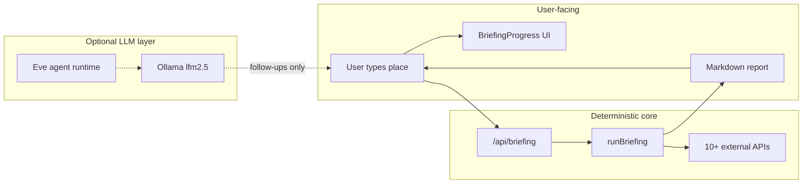
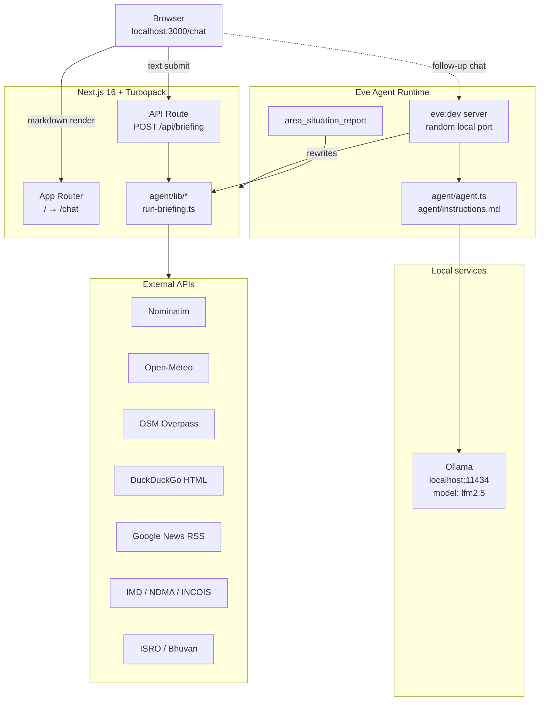
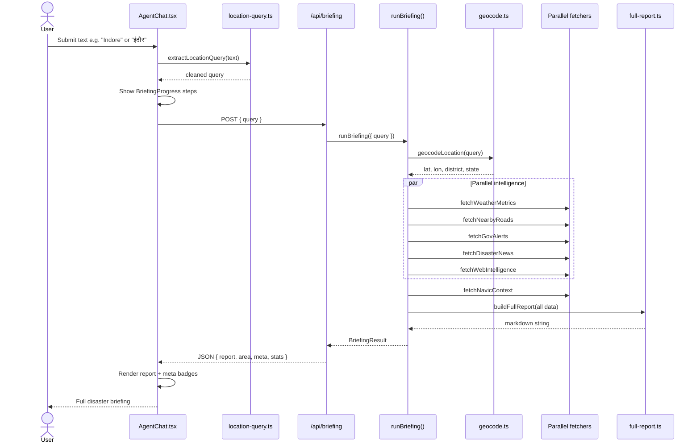
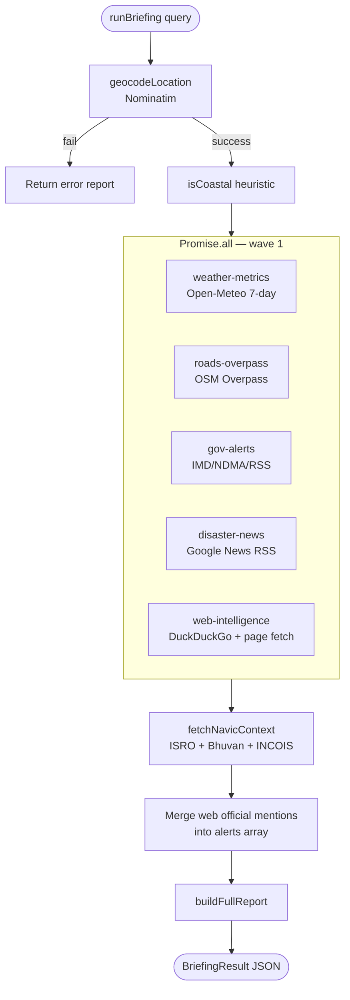
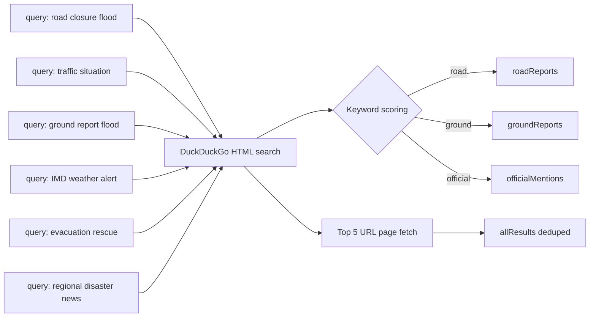
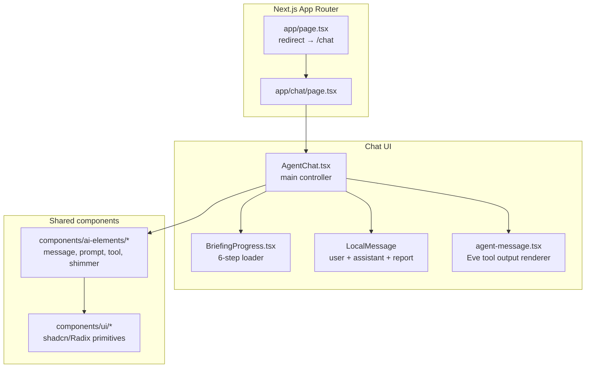
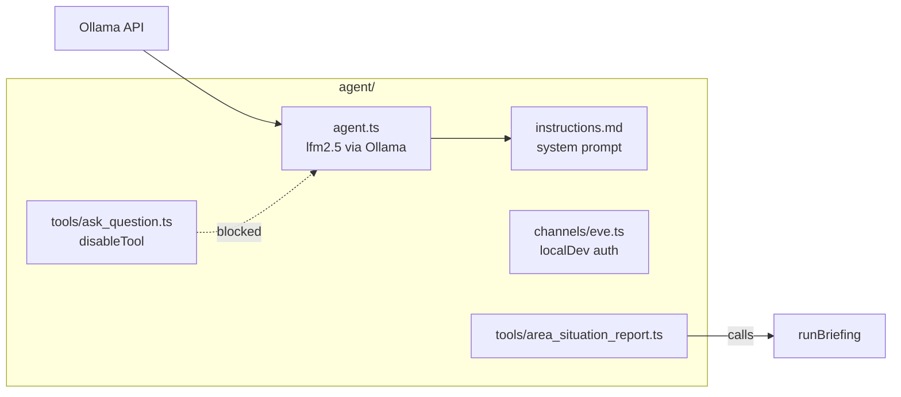
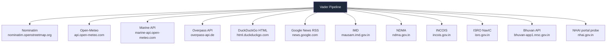

# Vader — System Architecture Blueprint

> **Vader** is a local-first disaster intelligence system for India. Users enter any place name (English, Hindi, or mixed) and receive a full operational briefing: weather, web-sourced ground reports, road conditions, NavIC/geospatial context, government alerts, news, risk assessment, and recommended actions.

This document explains **how the system actually works** — not just what files exist.

---

## 1. Design philosophy: pipeline-first, model-light

Vader deliberately separates **intelligence gathering** from **language generation**.

| Layer | Responsibility | Technology |
|-------|----------------|------------|
| **UI fast-path** | Accept user input, show progress, render report | React / Next.js |
| **Briefing pipeline** | Geocode, fetch, merge, score risk, format markdown | TypeScript (server-side) |
| **Local LLM** | Optional intro line; follow-up Q&A only | `lfm2.5` via Ollama |

**Why?** Small local models like `lfm2.5` are unreliable at multi-step tool calling. ~95% of Vader's value is deterministic server code + free public APIs. The model is a thin conversational wrapper, not the brain.



---

## 2. Runtime topology

When you run `./start.sh` or `npm run dev`, three processes cooperate:



### Port map

| Service | Default | Purpose |
|---------|---------|---------|
| Next.js dev | `3000` | Web UI + briefing API |
| Eve dev | dynamic (e.g. `37735`) | Agent chat WebSocket/HTTP |
| Ollama | `11434` | Local LLM inference |

---

## 3. End-to-end request flow

Every text submission (example chip or typed input) follows the **same path**.



### Input handling (any language)

[`lib/location-query.ts`](lib/location-query.ts) strips wrapper phrases but **always** routes non-empty text to the briefing pipeline:

| Input example | Extracted query |
|---------------|-----------------|
| `Indore` | `Indore` |
| `Chennai Marina` | `Chennai Marina` |
| `situation at Puri Odisha` | `Puri Odisha` |
| `इंदौर` | `इंदौर` |
| `दिल्ली में बाढ़` | `दिल्ली` |
| `19.0760, 72.8777` | coordinates as-is |

Nominatim geocoding handles Unicode place names.

---

## 4. The intelligence pipeline (`runBriefing`)

[`agent/lib/run-briefing.ts`](agent/lib/run-briefing.ts) is the **single orchestrator**. Both the REST API and the Eve tool call this function — one implementation, two entry points.



### Configuration knobs

| Env variable | Default | Effect |
|--------------|---------|--------|
| `BRIEFING_RADIUS_KM` | `5` | OSM road search radius (max 25) |
| `WEB_FETCH_TIMEOUT_MS` | `12000` | DuckDuckGo + page enrichment timeout |

---

## 5. Data modules reference

### 5.1 Geocoding — [`agent/lib/geocode.ts`](agent/lib/geocode.ts)

- **Source:** Nominatim (OpenStreetMap)
- **Output:** latitude, longitude, display name, district, state
- **Coastal detection:** bounding-box heuristic over India's coastline regions
- **Used by:** pipeline, risk context, NavIC marine layer

### 5.2 Weather — [`agent/lib/weather-metrics.ts`](agent/lib/weather-metrics.ts) + [`weather-narrative.ts`](agent/lib/weather-narrative.ts)

- **Sources:** `api.open-meteo.com`, `marine-api.open-meteo.com`
- **Forecast:** 7-day daily + 24-hour hourly (3-hour intervals in table)
- **Metrics:** 27+ current variables (temp, humidity, wind, CAPE, soil moisture, etc.)
- **Marine layer:** wave height, swell, sea surface temp (coastal coordinates)
- **Hazard flags:** heavy precip, high wind, saturated soil, severe WMO codes

### 5.3 Web intelligence — [`agent/lib/web-intelligence.ts`](agent/lib/web-intelligence.ts)

Free web search — no API keys required.



**Output categories:**
- `roadReports` — closures, traffic, waterlogging
- `groundReports` — flooding, evacuation, on-ground situation
- `officialMentions` — IMD/NDMA alert references found on the web

### 5.4 Roads — [`agent/lib/roads-overpass.ts`](agent/lib/roads-overpass.ts) + [`roads-report.ts`](agent/lib/roads-report.ts)

Two distinct data layers (clearly labeled in the report):

| Layer | Source | What it tells you |
|-------|--------|-------------------|
| **Infrastructure** | OSM Overpass | Road names, highway classes, bridges, tunnels, emergency facilities |
| **Live conditions** | Web intelligence | Reported closures, blockages, traffic disruptions |

- Queries Overpass sequentially (major roads → full inventory → emergency POIs) to avoid rate limits
- NHAI portal reachability probe (live closure GIS not publicly available)

### 5.5 Government alerts — [`agent/lib/gov-alerts.ts`](agent/lib/gov-alerts.ts)

- **Page scraping:** IMD, NDMA, state IMD pages, INCOIS (coastal)
- **RSS:** IMD warning RSS feed
- **Supplemental:** web-intel official mentions merged in `runBriefing`
- **Severity inference:** keyword-based (red/orange/yellow alert text)
- **Deduplication + ranking** by severity

### 5.6 Disaster news — [`agent/lib/disaster-news.ts`](agent/lib/disaster-news.ts)

- **Source:** Google News RSS (4 targeted queries per area)
- **Output:** up to 10 deduplicated articles with title, snippet, link, source
- **Theme detection:** flooding, cyclones, landslides, rescue, road disruptions

### 5.7 NavIC / geospatial — [`agent/lib/navic-context.ts`](agent/lib/navic-context.ts) + [`navic-report.ts`](agent/lib/navic-report.ts)

NavIC does **not** expose live satellite telemetry via public API. Vader provides operational context:

- NavIC primary zone check (India + ~1500 km)
- ISRO constellation status page scrape
- Bhuvan reverse geocode (village, district, state)
- INCOIS coastal alert keyword extraction
- GAGAN/SBAS augmentation notes
- Map portal deep links: Bhuvan, NASA Worldview, Sentinel Hub EO Browser
- Field-team operational guidance per coordinate

### 5.8 Report assembly — [`agent/lib/full-report.ts`](agent/lib/full-report.ts)

Merges all modules into a single markdown document with **10 sections**:

```
 1. Area & Coordinates
 2. Weather Situation          ← weather-narrative (7-day table + hourly)
 3. Geospatial & NavIC         ← navic-report
 4. Live Web Intelligence      ← web-intelligence-report
 5. Active Alerts & Hazards    ← gov-alerts + web official mentions
 6. Roads & Access             ← roads-report (OSM + live web)
 7. Disaster News              ← disaster-news
 8. Area Situation (Ground)     ← ground reports from web intel
 9. Overall Risk Assessment    ← computeRiskLevel()
10. Recommended Actions        ← buildActions()
    Sources                    ← reachable / failed API list
```

**Risk scoring** combines:
- Weather hazard flags (+2 each)
- Government alert severity (+1 to +4)
- Web risk signals: road blocked, evacuation, flooding, landslide, red alert (+2 each)
- Active disaster news volume (+2)

---

## 6. UI architecture



### Two message channels

| Channel | When used | Rendering |
|---------|-----------|-----------|
| **Local messages** | Every text submit → direct briefing | `LocalMessage` + `MessageResponse` (Streamdown markdown) |
| **Eve agent messages** | File attachments; legacy tool path | `AgentMessage` + `extractAreaReport()` |

The briefing report is rendered **directly in the chat** — the LLM does not need to repeat it.

### Progress UI

[`BriefingProgress.tsx`](app/chat/BriefingProgress.tsx) shows 6 animated steps while `/api/briefing` runs (~15–90 seconds depending on network):

1. Geocoding location
2. Fetching weather & 7-day forecast
3. Searching web for live reports
4. Mapping roads & infrastructure
5. Gathering NavIC & geospatial data
6. Building intelligence briefing

---

## 7. Agent layer (Eve + Ollama)

Vader uses the [Eve](https://www.npmjs.com/package/eve) agent framework integrated with Next.js via `withEve()` in [`next.config.ts`](next.config.ts).



### What the LLM actually does today

| User action | LLM involved? | What happens |
|-------------|---------------|--------------|
| Type any place name | **No** | UI → `/api/briefing` → full report |
| Click example chip | **No** | Same direct briefing path |
| Attach a file | **Yes** | Routed to Eve agent |
| Ask follow-up question | **Yes** | Eve + lfm2.5 answers from briefing context |

### Agent configuration — [`agent/agent.ts`](agent/agent.ts)

```
Model:          lfm2.5 (configurable via OLLAMA_MODEL)
Context window: 8192 tokens
Compaction:     70% threshold
Session limits: 8000 input / 4000 output tokens
Provider:       OpenAI-compatible → Ollama localhost:11434
```

### Disabled tools

Secondary tools were removed/disabled to prevent Eve startup crashes and reduce `lfm2.5` confusion. Only `area_situation_report` remains as a fallback tool path.

---

## 8. API contract

### `POST /api/briefing`

**Request:**
```json
{
  "query": "Indore",
  "radiusKm": 5
}
```

**Response (success):**
```json
{
  "success": true,
  "report": "# Disaster Intelligence Briefing\n...",
  "area": {
    "name": "Indore, ...",
    "latitude": 22.7196,
    "longitude": 75.8577,
    "district": "Indore",
    "state": "Madhya Pradesh",
    "coastal": false
  },
  "stats": {
    "weatherMetrics": 27,
    "roadSegments": 500,
    "newsArticles": 10,
    "alerts": 13,
    "hazardFlags": [],
    "webResults": 16
  },
  "meta": {
    "fetchedAt": "2026-08-31T14:00:00.000Z",
    "sourcesReachable": ["Nominatim", "open-meteo.com", "..."],
    "sourcesFailed": ["DuckDuckGo: \"...\""]
  }
}
```

**Response (geocode failure):**
```json
{
  "success": false,
  "error": "Location not found",
  "report": "Could not find location \"...\". Please try a more specific address."
}
```

---

## 9. Project structure

```
vader/
├── agent/                          # Eve agent definition
│   ├── agent.ts                    # Model + limits (Ollama lfm2.5)
│   ├── instructions.md             # System prompt (thin wrapper role)
│   ├── channels/eve.ts             # Local dev auth channel
│   ├── tools/
│   │   ├── area_situation_report.ts  # Eve tool → runBriefing()
│   │   └── ask_question.ts           # Disabled (no HITL pauses)
│   └── lib/                        # Intelligence pipeline modules
│       ├── run-briefing.ts         # ★ Central orchestrator
│       ├── full-report.ts          # Report builder + risk scoring
│       ├── geocode.ts              # Nominatim
│       ├── weather-metrics.ts      # Open-Meteo
│       ├── weather-narrative.ts    # Weather markdown
│       ├── web-intelligence.ts     # DuckDuckGo search
│       ├── web-intelligence-report.ts
│       ├── roads-overpass.ts       # OSM Overpass
│       ├── roads-report.ts         # Roads markdown
│       ├── gov-alerts.ts           # IMD/NDMA/RSS
│       ├── disaster-news.ts        # Google News RSS
│       ├── navic-context.ts        # ISRO/Bhuvan/INCOIS
│       ├── navic-report.ts         # NavIC markdown
│       └── fetch-utils.ts          # HTTP helpers + HTML strip
│
├── app/                            # Next.js App Router
│   ├── page.tsx                    # / → redirect /chat
│   ├── layout.tsx                  # Root layout + fonts
│   ├── chat/
│   │   ├── page.tsx
│   │   ├── AgentChat.tsx           # ★ Main UI controller
│   │   └── BriefingProgress.tsx    # Loading step animation
│   ├── api/briefing/route.ts       # ★ Direct briefing endpoint
│   └── _components/agent-message.tsx
│
├── lib/
│   ├── location-query.ts           # Input extraction (EN/HI)
│   └── utils.ts
│
├── components/                     # UI primitives
│   ├── ai-elements/                # Chat components
│   └── ui/                         # shadcn/Radix
│
├── scripts/test-pipeline.ts        # Integration tests
├── start.sh                        # Launcher (Ollama + npm run dev)
├── .env.example                    # Configuration template
├── next.config.ts                  # withEve() wrapper
└── architecture.md                 # This file
```

---

## 10. External dependencies map



All sources are **free public endpoints** — no API keys required.

---

## 11. Resilience and failure handling

| Failure | Behavior |
|---------|----------|
| Geocode not found | Return error report; suggest adding city + state |
| Open-Meteo down | Weather section shows "unavailable"; other sections continue |
| Overpass timeout | Roads section notes timeout; web road intel still included |
| DuckDuckGo query fails | That query marked in `sourcesFailed`; other queries continue |
| Bhuvan API fails | NavIC section proceeds without admin boundaries |
| Partial source failure | Report still generated; `Sources` section lists reached vs failed |

The pipeline uses `Promise.all` / `Promise.allSettled` so one slow or failed source does not block the entire briefing.

---

## 12. Testing

```bash
npm run test:pipeline
```

[`scripts/test-pipeline.ts`](scripts/test-pipeline.ts) runs end-to-end checks against live APIs for:
- `Kolar Bhopal MP`
- `Chennai Marina`

Validates: geocoding, weather metrics (≥20), roads, web intel, report length, required sections.

```bash
npm run typecheck    # TypeScript validation
npm run build        # Production build (Next.js + Turbopack)
```

---

## 13. How to run

```bash
# 1. Ensure Ollama is running with the model
ollama pull lfm2.5
ollama serve

# 2. Start Vader
cd vader
./start.sh
# or: npm run dev

# 3. Open
http://localhost:3000/chat
```

Copy [`.env.example`](.env.example) to `.env` to customize model, radius, and timeouts.

---

## 14. Key design decisions (summary)

| Decision | Rationale |
|----------|-----------|
| Direct `/api/briefing` bypasses LLM | `lfm2.5` unreliable at tool-calling; briefing is 100% API-driven |
| All text → briefing pipeline | User expects same experience for "Indore", "इंदौर", or long phrases |
| DuckDuckGo over paid search | Free, no API keys; Eve `web_search` disabled for Ollama |
| OSM + web for roads | OSM = infrastructure map; web = live reported conditions |
| NavIC = contextual, not telemetry | No public GNSS API; provide zone, maps, GAGAN, operational guidance |
| Single `runBriefing()` | API route and Eve tool share one implementation |
| Extensionless imports in `agent/lib` | Next.js Turbopack cannot resolve `.js` extensions on `.ts` files |

---

## 15. Architecture at a glance

```
┌─────────────────────────────────────────────────────────────────┐
│                         USER BROWSER                            │
│  ┌──────────────┐   ┌─────────────────┐   ┌───────────────┐ │
│  │ Prompt input │ → │ BriefingProgress │ → │ Markdown report│ │
│  │ (any language)│   │ (6 steps)        │   │ (10 sections)  │ │
│  └──────────────┘   └─────────────────┘   └───────────────┘ │
└────────────────────────────┬────────────────────────────────────┘
                             │ POST /api/briefing
┌────────────────────────────▼────────────────────────────────────┐
│                    runBriefing() ORCHESTRATOR                     │
│  ┌─────────┐ ┌─────────┐ ┌─────────┐ ┌─────────┐ ┌──────────┐ │
│  │Geocode  │ │Weather  │ │Web Intel│ │Roads    │ │Gov Alerts│ │
│  │Nominatim│ │OpenMeteo│ │DuckDuckGo│ │Overpass │ │IMD/NDMA  │ │
│  └─────────┘ └─────────┘ └─────────┘ └─────────┘ └──────────┘ │
│  ┌─────────┐ ┌─────────┐ ┌─────────────────────────────────────┐│
│  │News RSS │ │NavIC    │ │ buildFullReport() → risk + actions  ││
│  │Google   │ │ISRO/Bhuvan│ └─────────────────────────────────┘│
│  └─────────┘ └─────────┘                                       │
└────────────────────────────┬────────────────────────────────────┘
                             │ optional follow-ups
┌────────────────────────────▼────────────────────────────────────┐
│              Eve Agent + Ollama (lfm2.5) — thin wrapper         │
└─────────────────────────────────────────────────────────────────┘
```

---

*Last updated: August 2026 — reflects the pipeline-first revamp architecture.*
